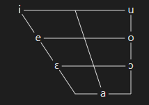
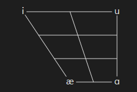
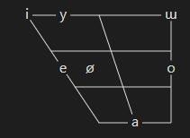
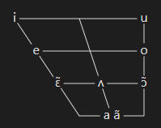
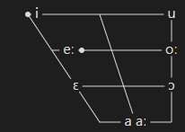
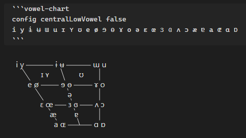
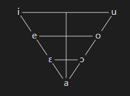
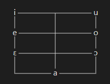
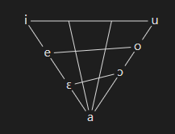
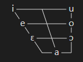

# Obsidian Vowel Chart

This plugin generates a [vowel diagram](https://en.wikipedia.org/wiki/Vowel_diagram) used for showing a language inventory of vowels.

## Usage

The simplest usage of the plugin is to create a code block with the `vowel-chart` tag, and write vowels in the [IPA](https://en.wikipedia.org/wiki/International_Phonetic_Alphabet):

````
```vowel-chart
; example: Italian vowels
i e ɛ a ɔ o u
```
````



### Adding vowels

Another way to add vowels is with the `add` command, with it you can specify a position and a label, there are three ways of specifying position, as follows, they can be mixed freely.

#### Position by coordinates

Numerical coordinates start with (0, 0) at the top-left and end in (2, 3) in the bottom-right.

```vowel-chart
add (0, 0) "i"
add (2, 3) "ɑ"
add (0, 3) "æ"
add (2, 0) "u"
```



#### Position by keywords

Use the keywords `high/low/mid/close/open/front/central/back` to position the vowels, the order is irelevant. Also supports the keyword `near` for intermediary positions.

```vowel-chart
add high front "i"
add high near-front "y"
add mid front "e"
add mid near-front "ø"
add mid back "o"
add low central "a"
add high back "ɯ"
```



#### Position by IPA

This positions vowels by their position in the IPA chart. In that option the label is optional, if absent the same text in the position is used.

The position is defined just by the first character in brackets, that way diacritics are automatically supported.

```vowel-chart
add [ɜ] "ʌ"
add [a] "a ã"
add [i]
add [u]
add [e]
add [o]
add [ɛ̃]
add [ɔ̃]
```



### Dot

`add` commands can be used together with the simple usage, and it can add a dot and position the text to the `right` or `left`:

```vowel-chart
add [a] "a aː"
add left near-front high-mid "eː"
add right (0, 0) "i"
ɛ ɔ oː u
```



## Settings

### Positioning of low vowels

In the charts above, the position of the low vowels [æ a] is different from the original IPA chart, this behaviour can be changed by the `config centralLowVowel false` command:



This option can also be turned off by default on the plugin settings.

### Layout

There are 4 chart layout options, they can be chosen with the `layout` command.

- `layout trapezoid` like the original IPA chart

    

- `layout triangle` an alternative to the original

    

- `layout square`

    

- `layout formant` arranged according to [formants](https://en.wikipedia.org/wiki/Formant)

    

The default layout can be set in the plugin settings.

### Size

The command `config size <size>` defines the size of the chart. The default can be set in the plugin settings.

The size is the vertical distance in pixels from the high line to the high-mid line.

```vowel-chart
config size 25
i e ɛ a ɔ o u
```



## Manually installing the plugin

- Copy over `main.js`, `styles.css`, `manifest.json` to your vault `VaultFolder/.obsidian/plugins/vowel-chart/`.
